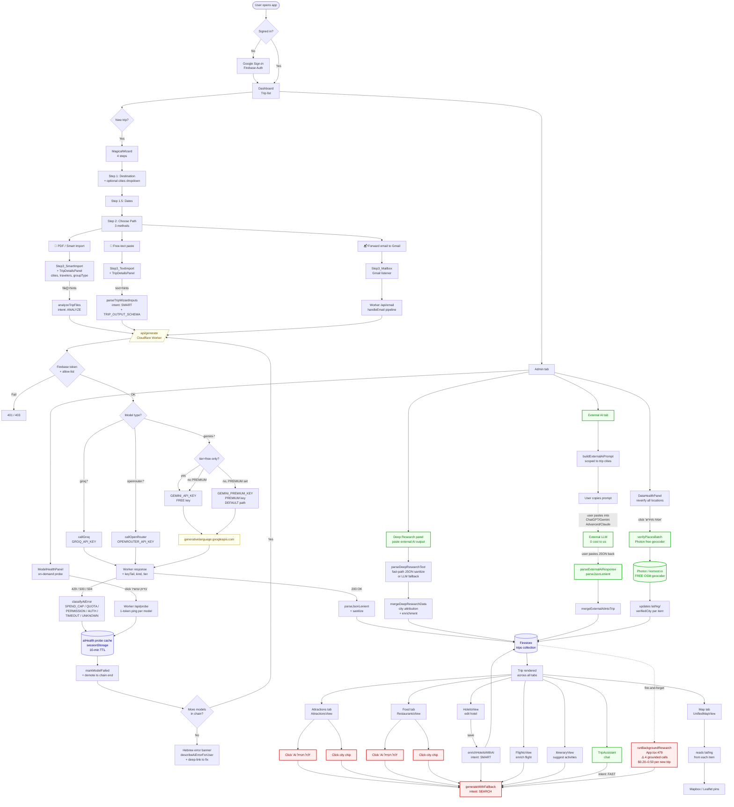
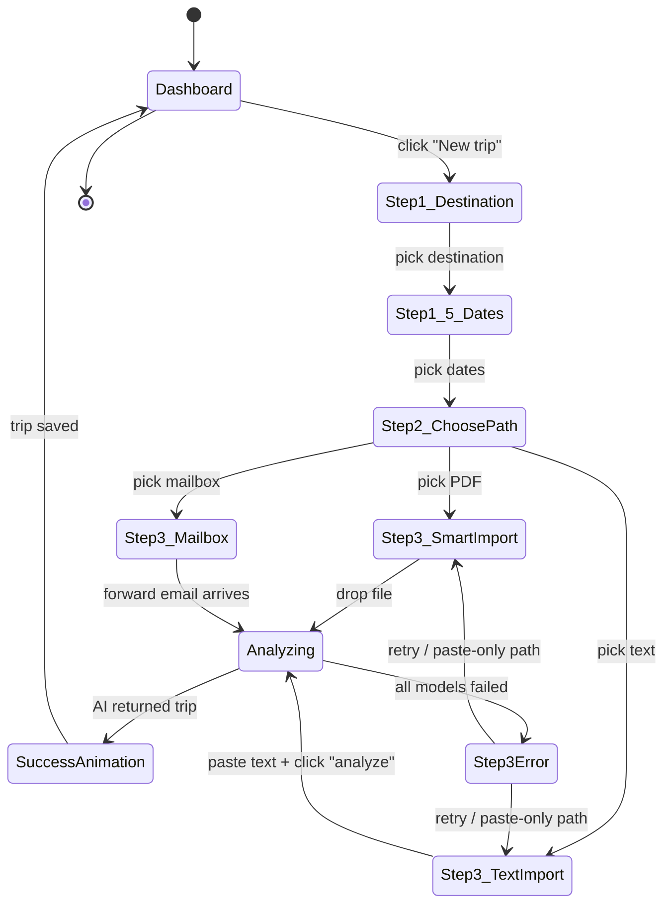
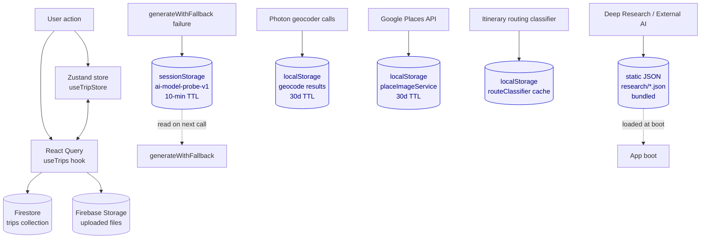

# AI Flows + User Paths — Admin Overview

> Generated 2026-05-21. Covers every place in the app where an AI call happens,
> every user-facing entry point, and the storage / cache / cost guards that
> wrap them. Built for the admin / developer who needs to know "where does
> money get spent and which path can I disable without breaking things".

This document uses Mermaid diagrams. To view rendered:
- **GitHub** — open this file in the repo, GitHub renders Mermaid natively.
- **VSCode** — install "Markdown Preview Mermaid Support" extension (`bierner.markdown-mermaid`).
- **Online** — copy any code block into [mermaid.live](https://mermaid.live).

---

## 1. Master flow — every path from user to AI

### Legend

| Color | Meaning |
|---|---|
| 🔴 Red | Expensive AI calls — Gemini grounded SEARCH or Worker-billed paths |
| 🟢 Green | Free paths — Photon, Deep Research paste, external AI copy/paste, FAST chat |
| 🟡 Yellow | Cloudflare Worker code |
| 🔵 Blue | Persistent storage (Firestore, sessionStorage cache) |

---

## 2. Fallback chains — model order per intent

```mermaid
flowchart LR
    subgraph SMART_CHAIN ["SMART_CANDIDATES — trip extraction from text/PDF"]
        direction TB
        S1[gemini-3.5-flash] --> S2[gemini-3.1-flash-lite] --> S3[gemini-2.5-flash] --> S4[gemini-2.5-flash-lite] --> S5[gemini-2.5-pro] --> S6[groq:llama-3.3-70b-versatile] --> S7[groq:llama-3.1-8b-instant] --> S8[openrouter:llama-3.3-70b:free] --> S9[openrouter:llama-3.1-405b:free] --> S10[openrouter:gemma-2-9b:free] --> S11[openrouter:mistral-7b:free]
    end

    subgraph DOC_CHAIN ["DOC_CANDIDATES — PDF / heavy doc extraction (Pro-first)"]
        direction TB
        D1[gemini-2.5-pro] --> D2[gemini-3.5-flash] --> D3[gemini-3.1-flash-lite] --> D4[gemini-2.5-flash]
    end

    subgraph SEARCH_CHAIN ["RESEARCH_CANDIDATES — grounded restaurant / attraction search"]
        direction TB
        R1[gemini-3.5-flash + googleSearch] --> R2[gemini-2.5-flash + googleSearch] --> R3[gemini-3.1-flash-lite] --> R4[gemini-2.5-pro] --> R5[gemini-2.5-flash-lite] --> R6[groq:llama-3.3-70b<br/>⚠️ UNGROUNDED] --> R7[openrouter:llama-3.3-70b:free]
    end

    subgraph FAST_CHAIN ["FAST_CANDIDATES — chat, quick UI suggestions"]
        direction TB
        F1[gemini-3.1-flash-lite] --> F2[gemini-2.5-flash-lite] --> F3[gemini-2.5-flash] --> F4[openrouter:llama-3.3-70b:free]
    end

    classDef grounded fill:#fee,stroke:#c00,color:#700
    classDef ungrounded fill:#ffe,stroke:#a80,color:#640
    classDef free fill:#efe,stroke:#0a0,color:#070

    class R1,R2 grounded
    class R6 ungrounded
    class S6,S7,S8,S9,S10,S11,F4,R7 free
```

The auto-demote layer ([services/aiHealth.ts](../services/aiHealth.ts)) intercepts every failure and rewrites these chains at runtime — models that hit `SPEND_CAP`, `QUOTA`, `PERMISSION`, `AUTH`, or `INVALID_MODEL` get demoted to the end (or dropped entirely) for the rest of the session.

---

## 3. User-state machine — the wizard

---

## 4. Where the money actually goes

| Path | When it fires | Approx cost / fire | How to avoid |
|---|---|---|---|
| `runBackgroundResearch` (App.tsx:479) | Auto, on every new trip completion | $0.20–0.50 (4 grounded SEARCH calls) | Part C of plan — gate behind admin toggle |
| `RestaurantsView` "AI לכל הטיול" button | User click | $0.05–0.10 (1 large grounded SEARCH) | Part B — add paste-from-external-AI sibling button |
| `RestaurantsView` city-research chip | User click on city chip | $0.03–0.05 (1 city-scoped grounded SEARCH) | Same |
| `AttractionsView` same patterns | User click | $0.03–0.10 each | Same |
| `analyzeTripFiles` (PDF) | User uploads PDF during wizard | $0.02–0.05 (Pro 2.5 multimodal) | Already optimized — only fires on user action |
| `parseTripWizardInputs` (text) | User pastes text in wizard | $0.005 (Flash 3.5) | Already cheap |
| `enrichHotelsWithAI` (HotelsView save) | User saves hotel | $0.005 (Flash, SMART) | Cheap |
| Chat (TripAssistant) | User sends chat message | $0.001 (Flash-Lite, FAST) | Cheap |

**TL;DR**: 95% of Gemini spend is in the SEARCH chain. The Deep Research manual-paste flow already exists as a free alternative — Part B of the plan extends it from admin-only to RestaurantsView / AttractionsView too.

---

## 5. Storage + cache layers

---

## 6. Where to look in code

| Concept | File:line |
|---|---|
| Single AI entry point | [services/aiService.ts](../services/aiService.ts) — `generateWithFallback` |
| Worker gateway | [workers/src/index.ts](../workers/src/index.ts) — `/api/generate` |
| Probe + cache | [services/aiHealth.ts](../services/aiHealth.ts) |
| Error classification | `classifyAiError`, `describeAiErrorForUser` in [services/aiService.ts](../services/aiService.ts) |
| Model chains | `GOOGLE_MODELS` constant in [services/aiService.ts](../services/aiService.ts) |
| Wizard root | [components/onboarding/MagicalWizard.tsx](../components/onboarding/MagicalWizard.tsx) |
| PDF import | [components/onboarding/Step3_SmartImport.tsx](../components/onboarding/Step3_SmartImport.tsx) |
| Text import | [components/onboarding/Step3_TextImport.tsx](../components/onboarding/Step3_TextImport.tsx) |
| Mailbox import | [components/onboarding/Step3_Mailbox.tsx](../components/onboarding/Step3_Mailbox.tsx) |
| Background research | [services/backgroundResearch.ts](../services/backgroundResearch.ts), triggered in [App.tsx:479](../App.tsx) |
| Deep Research paste | [components/DeepResearchPanel.tsx](../components/DeepResearchPanel.tsx) + `parseDeepResearchText` in aiService |
| External AI copy | [services/externalAiImport.ts](../services/externalAiImport.ts) — `buildExternalAiPrompt`, `parseExternalAiResponse` |
| Verify locations | [components/admin/DataHealthPanel.tsx](../components/admin/DataHealthPanel.tsx) — `reverifyAll` |
| Model health panel | [components/admin/ModelHealthPanel.tsx](../components/admin/ModelHealthPanel.tsx) |
| Place geocoding | [utils/placeVerification.ts](../utils/placeVerification.ts), [utils/geocodePlaces.ts](../utils/geocodePlaces.ts) |
| JSON sanitizer (shared) | [services/jsonSanitizer.ts](../services/jsonSanitizer.ts) |

---

## 7. Things to consider when changing the diagram

- **Adding a new intent**: add a new `*_CANDIDATES` chain in `GOOGLE_MODELS`, route it in `generateWithFallback`'s `if/else if` chain, document the cost profile here.
- **Adding a new provider** (e.g. Together AI, Cerebras): mirror the `callGroq` / `callOpenRouter` pattern in Worker, add a `provider:*` prefix detector, add models to relevant chains, update the cost table above.
- **Removing a paid path**: replace the in-app button with a "Copy prompt → paste back" modal that reuses `parseExternalAiResponse` or `parseDeepResearchText`. This is the pattern Part B of the active plan uses.
